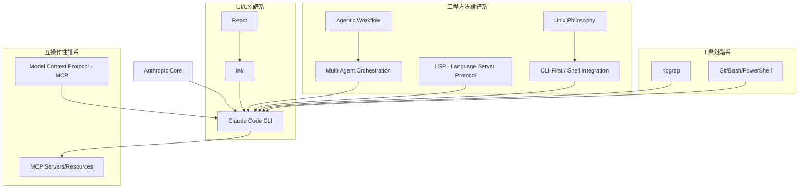

# Claude Code 外部視角與智識譜系分析報告

## 1. 項目概述
**Claude Code (Open-ClaudeCode / Happy Version)** 是一個由 Anthropic 開發的高級 AI 編程助手 CLI 工具。本分析對象為基於官方 `@anthropic-ai/claude-code@2.1.88` npm 包通過 Source Map 恢復的開源研究版本（Happy Version）。

該系統不僅僅是一個聊天界面，而是一個深度集成於開發者終端（Terminal）的**代理執行環境**，旨在通過模型驅動的工具調用（Tool-use）直接操作文件系統、執行 Shell 指令並管理複雜的編程工作流。

---

## 2. 智識譜系地圖 (Knowledge Lineage Map)

---

## 3. 核心工程方法論分析

### 3.1 TUI-First 交互設計
不同於大多數 AI 助手依賴 IDE 插件或 Web 界面，Claude Code 採用了 **TUI (Terminal User Interface)** 路徑。
- **技術實現**：利用 `Ink` 將 React 的聲明式 UI 帶入終端。
- **設計意圖**：將 AI 助手直接置於開發者的「第一生產力現場」（Shell），消除在 IDE 與終端之間切換的上下文開銷。

### 3.2 Agent-Tool-Command 模塊化架構
系統將能力解構為三個維度：
- **Tools (工具)**：原子的能力單元（如 `FileRead`, `BashTool`, `WebFetch`），定義了模型可以對外部世界產生的影響。
- **Commands (命令)**：用戶觸發的高級功能（如 `/compact`, `/cost`），封裝了特定的業務邏輯。
- **Agents (代理)**：專精於特定階段的智能體（如 `planAgent` 負責規劃, `verificationAgent` 負責驗證），實現了**多代理協同 (Multi-Agent Orchestration)**。

### 3.3 MCP (Model Context Protocol) 的骨幹作用
MCP 是該系統差異化的核心。Claude Code 將 MCP 作為標準的擴展平面：
- **資源發現**：通過 MCP 獲取外部數據資源。
- **工具擴展**：允許第三方通過 MCP Server 實時為助手增加新工具，而無需修改主程序代碼。

### 3.4 權限護欄 (Permission Guardrails)
針對 CLI 工具的高權限風險，系統實施了嚴格的物理級權限管理：
- **分類攔截**：對 `Bash`, `FileWrite`, `WebFetch` 等操作進行分級。
- **動態確認**：在執行高風險操作前，強制通過 TUI 請求用戶批准。

---

## 4. 定位與差異化分析

| 維度 | Cursor / GitHub Copilot | Claude Dev (Cline) | Claude Code (Happy Version) |
| :--- | :--- | :--- | :--- |
| **交互形態** | IDE 插件 (Sidebar/Inline) | IDE 插件 (VS Code) | **獨立 CLI (Terminal)** |
| **控制重心** | 代碼補全 $\rightarrow$ 聊天 | 代理執行 $\rightarrow$ 文件編輯 | **Shell 集成 $\rightarrow$ 系統級操作** |
| **擴展機制** | 封閉/插件 API | 自定義工具 | **標準化 MCP 協議** |
| **執行路徑** | 依賴 IDE API | 依賴 IDE 權限 | **直接操作 OS 資源 (ripgrep, Bash)** |
| **官方屬性** | 廠商產品 | 社區驅動 | **Anthropic 官方實現** |

**核心差異化點**：Claude Code 試圖定義一種「AI 原生終端」的體驗。它不試圖取代 IDE，而是通過 MCP 和 TUI 成為 IDE 之外的**操作系統級 AI 助手**。

---

## 5. 對「Happy Version」變體的評價與定位

**「Happy Version」** 並非一個功能分支，而是一個**「白盒化」的研究樣本**。
- **定位**：它是通過 Source Map 恢復的官方內核。其意義在於將原本封裝在 npm 包中的「黑盒」邏輯轉化為可讀的 TypeScript 源码。
- **評價**：
    - **研究價值**：為 AI 工程師提供了研究「官方如何實現可靠 Agent 循環」的最高質量樣本。
    - **透明度**：揭示了 Anthropic 在處理 Token 經濟、上下文壓縮（Compact）和權限控制上的具體實現方案。
    - **社群意義**：使社群能夠在官方框架之上，通過研究 `src/` 實現更精準的插件開發與能力對齊。

---

## 6. 引用來源 (References)
- `ACKNOWLEDGEMENTS.md`: 確認項目來源為 `@anthropic-ai/claude-code@2.1.88`。
- `LICENSE`: 確認版權歸屬與研究用途。
- `README.md`: 確認項目結構、模型支持與運行模式。
- `src/tools/AgentTool/built-in/`: 識別出 `planAgent`, `verificationAgent` 等多代理架構。
- `src/services/mcp/`: 分析 MCP 協議的集成方式。
- `src/components/permissions/`: 分析權限攔截機制。
