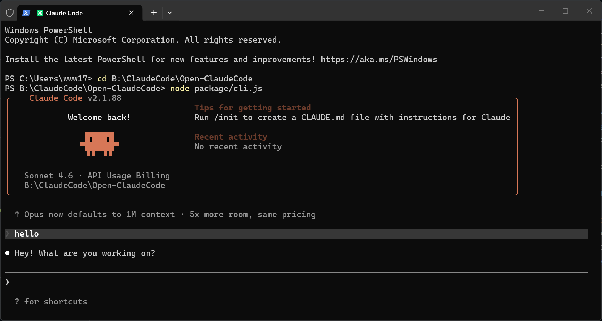

# Open-ClaudeCode

> Fully open-source Claude Code project - Reconstructed from Anthropic's official source code

🌐 **Languages**: [中文](README.md) | [English](README.en.md)

---

## 🙏 Special Thanks

**This project sincerely thanks Anthropic for their open-source contributions!**

Anthropic releases Claude Code via npm packages, enabling us to learn and study this excellent AI programming assistant architecture. The source code in this project is recovered from the official npm package's source maps, for learning and research purposes only.

> "You're right, I shouldn't have published map files to npm. This is a very serious mistake."

We understand that source map files are intended for development debugging, not public release. Anthropic's recognition and handling of this issue is worth learning from.

---

## 📖 Project Overview

Open-ClaudeCode is a complete open-source version of Claude Code, including:

- ✅ **Runnable CLI** - Compiled executable files (v2.1.88)
- ✅ **TypeScript Source** - 1,902 recovered source files for study
- ✅ **Official Plugins** - 13 Anthropic official plugins
- ✅ **Configuration Examples** - Settings configurations for various scenarios
- ✅ **Complete Documentation** - Project instructions, user guides, CHANGELOG

---

## 📁 Directory Structure

```
Open-ClaudeCode/
├── package/              # Runnable CLI
│   ├── cli.js            # Compiled CLI (12.5MB)
│   ├── cli.js.map        # Source Map (57MB)
│   ├── package.json      # Package configuration
│   ├── bun.lock          # Bun lock file
│   ├── sdk-tools.d.ts    # SDK type definitions (117KB)
│   └── vendor/           # Native binary modules
│       ├── audio-capture/   # Audio capture (6 platforms)
│       └── ripgrep/         # Code search tool (6 platforms)
├── src/                  # Complete TypeScript source (1,902 files)
│   ├── tools/            # 30+ tool implementations (184 files)
│   ├── commands/         # 50+ command implementations (207 files)
│   ├── services/         # API, MCP, OAuth services (130 files)
│   ├── components/       # React UI components (389 files)
│   ├── ink/              # Ink UI framework (96 files)
│   ├── utils/            # Utility functions (564 files)
│   ├── hooks/            # React Hooks (104 files)
│   ├── bridge/           # Bridge modules (31 files)
│   ├── vendor/           # Native module sources (4 files)
│   └── ...               # More modules
├── plugins/              # 13 official plugins
│   ├── agent-sdk-dev/
│   ├── claude-opus-4-5-migration/
│   ├── code-review/
│   ├── commit-commands/
│   ├── explanatory-output-style/
│   ├── feature-dev/
│   ├── frontend-design/
│   ├── hookify/
│   ├── learning-output-style/
│   ├── plugin-dev/
│   ├── pr-review-toolkit/
│   ├── ralph-wiggum/
│   └── security-guidance/
├── examples/             # Configuration examples
│   └── settings/         # strict / lax / bash-sandbox
├── docs/                 # Documentation
├── README.md             # This file
├── ACKNOWLEDGEMENTS.md   # Acknowledgements
├── CHANGELOG.md          # Version changelog
├── LICENSE               # License description
├── .gitignore            # Git ignore rules
└── .gitattributes        # Git attributes
```

---

## 🚀 Quick Start

### Prerequisites

- **Node.js 18+** ([Download](https://nodejs.org/))
- **API Key** (choose one):
  - 🔵 **Anthropic Official API** — Register at [console.anthropic.com](https://console.anthropic.com/) to get API Key
  - 🟢 **Third-party Proxy** — Recommended for users in certain regions, get proxy URL and API Key
  - 🔴 **Claude Subscription** — Login via OAuth after running (requires network access)

### Step 1: Clone and Run

```bash
# 1. Clone the repository
git clone https://github.com/LING71671/Open-ClaudeCode.git
cd Open-ClaudeCode

# 2. Verify environment
node --version          # Requires >= 18.0.0
node package/cli.js --version  # Should show 2.1.88

# 3. Start!
node package/cli.js
```

### Step 2: Authentication

Authentication is required on first run, choose **any one** method:

#### Method 1: Third-party Proxy (Recommended for certain regions)

1. Get API URL and key from third-party proxy provider
2. Create `settings.json`:
```json
{
  "env": {
    "ANTHROPIC_BASE_URL": "https://your-proxy-url",
    "ANTHROPIC_AUTH_TOKEN": "sk-your-api-key"
  }
}
```
3. Run: `node package/cli.js --settings settings.json`

#### Method 2: Anthropic Official API

1. Visit [console.anthropic.com](https://console.anthropic.com/) to register
2. Get API Key (format: `sk-ant-...`)
3. Create `settings.json`:
```json
{
  "env": {
    "ANTHROPIC_AUTH_TOKEN": "sk-ant-your-key"
  }
}
```
4. Run: `node package/cli.js --settings settings.json`

#### Method 3: Claude Subscription (OAuth)

Requires Claude subscription:

```bash
# Run directly, will open browser for login
node package/cli.js
```

---

## 🖥️ Screenshot



---

## 📖 Usage Tutorial

### Mode 1: Interactive Mode (Recommended for beginners)

Run directly, chat-like interface:

```bash
node package/cli.js
```

After entering, you'll see the interactive interface where you can input questions or commands:

```
> Create a Python Flask project for me
> Explain this code
> Help me fix this bug
```

**Common operations:**
- Type text → Press Enter to send
- `Ctrl+C` → Interrupt current action
- `/help` → View all available commands
- `/clear` → Clear conversation
- `/exit` → Exit

### Mode 2: Non-interactive Mode (Script/Pipeline)

For automation and scripting:

```bash
# Simple Q&A
node package/cli.js -p "Explain what is a closure"

# Process files
node package/cli.js -p "Help me refactor the getUser function in src/main.ts"

# Specify model
node package/cli.js -p "Write a sorting algorithm" --model sonnet

# JSON output (for program processing)
node package/cli.js -p "List files in current directory" --output-format json
```

### Mode 3: Continue Previous Conversation

```bash
# Continue most recent conversation in current directory
node package/cli.js -c

# Resume specific session
node package/cli.js -r <session-id>
```

---

## ⚙️ Common Configurations

### 🔑 Configure Your Own API (Third-party Proxy / Custom Endpoint)

If you use third-party API proxy services or have custom endpoints:

#### Method 1: Via Settings File (Recommended, persistent)

1. Create configuration file:

```json
// settings.json
{
  "env": {
    "ANTHROPIC_BASE_URL": "https://your-proxy-url",
    "ANTHROPIC_AUTH_TOKEN": "sk-your-api-key"
  }
}
```

2. Load configuration at runtime:

```bash
node package/cli.js --settings settings.json
```

#### Method 2: Via Environment Variables (Temporary)

```bash
# Bash/Zsh
export ANTHROPIC_BASE_URL="https://your-proxy-url"
export ANTHROPIC_AUTH_TOKEN="sk-your-api-key"
node package/cli.js
```

```powershell
# PowerShell
$env:ANTHROPIC_BASE_URL = "https://your-proxy-url"
$env:ANTHROPIC_AUTH_TOKEN = "sk-your-api-key"
node package/cli.js
```

```cmd
# CMD
set ANTHROPIC_BASE_URL=https://your-proxy-url
set ANTHROPIC_AUTH_TOKEN=sk-your-api-key
node package/cli.js
```

#### Method 3: Via Global Configuration Directory

Claude Code automatically reads `~/.claude/settings.json`:

```json
// C:\Users\YourUsername\.claude\settings.json  (Windows)
// ~/.claude/settings.json  (macOS/Linux)
{
  "env": {
    "ANTHROPIC_BASE_URL": "https://your-proxy-url",
    "ANTHROPIC_AUTH_TOKEN": "sk-your-api-key"
  }
}
```

After configuration, every run of `node package/cli.js` will automatically use these settings.

#### Supported Model Aliases

```bash
# Common models
node package/cli.js --model sonnet     # Claude Sonnet (default)
node package/cli.js --model opus       # Claude Opus (most powerful)
node package/cli.js --model haiku      # Claude Haiku (fastest)

# Full model names
node package/cli.js --model claude-sonnet-4-6
node package/cli.js --model claude-opus-4-6
```

#### ⚠️ Notes

- Third-party proxies may not support all models, please refer to your provider's model list
- `ANTHROPIC_AUTH_TOKEN` and `ANTHROPIC_API_KEY` either one works
- If both environment variables and settings file are configured, environment variables take precedence
- **Do not share configuration files containing API keys in public repositories**

---

### Select Model

```bash
# Sonnet (default, fast, good cost-performance)
node package/cli.js --model sonnet

# Opus (most powerful, but slower and more expensive)
node package/cli.js --model opus

# Haiku (fastest and cheapest)
node package/cli.js --model haiku
```

### Permission Modes

```bash
# Default mode (requires confirmation for each action)
node package/cli.js

# Auto-accept edits (no confirmation needed for file modifications)
node package/cli.js --permission-mode acceptEdits

# Skip all permission checks (⚠️ sandbox environment only)
node package/cli.js --dangerously-skip-permissions
```

### Using Plugins

```bash
# Load plugins from specified directory
node package/cli.js --plugin-dir ./plugins/code-review

# Load multiple plugins
node package/cli.js --plugin-dir ./plugins/code-review --plugin-dir ./plugins/commit-commands
```

---

## 🎯 Practical Examples

### Example 1: Let Claude Write Code for You

```bash
# Go to your project directory
cd your-project

# Start Claude
node /path/to/Open-ClaudeCode/package/cli.js

# Then input:
> Create a user login API using Express.js
> Add unit tests for this function
> Fix the type error in src/auth.ts
```

### Example 2: Code Review

```bash
# Using code-review plugin
node package/cli.js --plugin-dir ./plugins/code-review

# Or directly ask Claude to review
> Help me review the recent git diff
> Check if this PR has any potential issues
```

### Example 3: Git Workflow

```bash
# Using commit-commands plugin
node package/cli.js --plugin-dir ./plugins/commit-commands

# Or use built-in command directly
> /commit    # Smart commit message generation
```

---

## 📋 Built-in Commands Quick Reference

In interactive mode, type `/` for commands:

| Command | Description |
|---------|-------------|
| `/help` | Show help |
| `/clear` | Clear conversation |
| `/compact` | Compress conversation history |
| `/model` | Switch model |
| `/theme` | Switch theme |
| `/vim` | Toggle Vim mode |
| `/cost` | View cost statistics |
| `/stats` | View usage statistics |
| `/share` | Share session |
| `/exit` | Exit |

---

## ❓ FAQ

### Q: What if it asks for authentication?
A: First run requires authentication. After running, it will automatically open a browser for login with your Claude account. Or set the `ANTHROPIC_API_KEY` environment variable.

### Q: It's stuck after running?
A: Check your network connection. If in certain regions, you may need a proxy:
```bash
export HTTPS_PROXY="http://127.0.0.1:7890"
node package/cli.js
```

### Q: How to check how much I spent?
A: In interactive mode, type `/cost` or `/stats` to view.

### Q: How to configure third-party proxy or custom API?
A: Create a `settings.json` file with the following content:
```json
{
  "env": {
    "ANTHROPIC_BASE_URL": "https://your-proxy-url",
    "ANTHROPIC_AUTH_TOKEN": "sk-your-api-key"
  }
}
```
Then run `node package/cli.js --settings settings.json`. You can also place it in `~/.claude/settings.json` for global configuration.

### Q: Can I run it in any directory?
A: Yes! But it's recommended to run in your project directory so Claude can access project files.

### Q: What's the difference from npm installation?
A: This repository provides complete source code recovered from the npm package, suitable for learning and research. Functionally identical to the npm-installed version.

---

## 📚 Learning the Source Code

Source code is located in the `src/` directory, containing 1,902 source files:

```bash
# View entry point
cat src/main.tsx

# View tool implementations
ls src/tools/

# View command implementations
ls src/commands/
```

### Using Plugins

Plugins are located in the `plugins/` directory, containing 13 official plugins:

```bash
# View plugin list
ls plugins/

# View plugin details
cat plugins/ralph-wiggum/.claude-plugin/plugin.json
```

---

## 📊 Project Statistics

| Category | Count |
|----------|-------|
| TypeScript source (.ts + .tsx) | 1,884 files |
| JavaScript source (.js) | 18 files |
| All source files total | 1,902 files |
| Tool implementations | 30+ |
| Command implementations | 50+ |
| Service modules | 15+ |
| UI components | 25+ |
| Official plugins | 13 |
| Native modules | 2 (audio-capture, ripgrep) |
| Supported platforms | 6 (macOS/Linux/Windows × arm64/x64) |

---

## 📜 License

Source code copyright belongs to **Anthropic PBC**.

This repository is for learning and research purposes only and does not represent Anthropic's official position.

See [LICENSE](LICENSE) and [ACKNOWLEDGEMENTS.md](ACKNOWLEDGEMENTS.md) for details.

---

## 🔗 Related Links

- [Anthropic Official Website](https://www.anthropic.com/)
- [Claude Code Documentation](https://code.claude.com/)
- [This Project GitHub](https://github.com/LING71671/Open-ClaudeCode)
- [Discussion](https://github.com/LING71671/Open-ClaudeCode/issues/2)

---

*Last updated: 2026-04-01*
